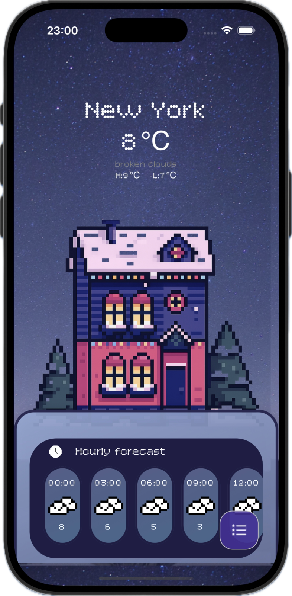
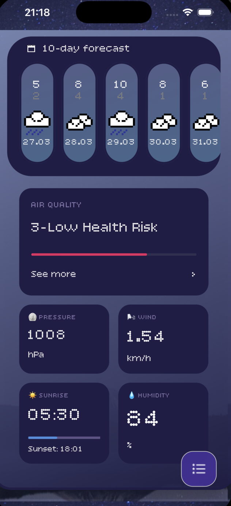
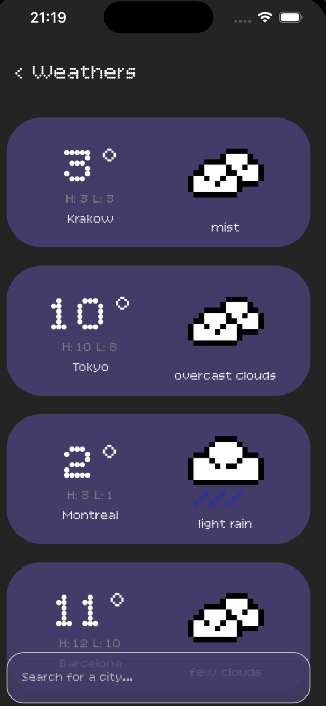

# 🌤️ Pixel Weather App

<div align="center">

[](https://dotnet.microsoft.com/en-us/apps/maui)
[](https://dotnet.microsoft.com/en-us/apps/maui)
[](https://opensource.org/licenses/MIT)
[](https://openweathermap.org/api)

*A cross-platform weather application built with .NET 10 MAUI, featuring a pixel-art aesthetic and real-time data from OpenWeatherMap.*

<p align="center">
  
  &nbsp;&nbsp;
  
  &nbsp;&nbsp;
  
</p>

</div>

---

## Features

| Feature | Details |
|---|---|
| **Current Weather** | Temperature, condition, humidity, wind, pressure |
| **Hourly Forecast** | Next 24h in 3-hour intervals |
| **10-Day Forecast** | Daily high/low with pixel icons |
| **Sunrise / Sunset** | Local times pulled from API |
| **Day / Night Theme** | Background and palette switch automatically |
| **Multi-City** | Save and browse multiple cities |

---

## Tech Stack

- **Framework:** .NET 10 MAUI
- **Language:** C# 13
- **API:** [OpenWeatherMap](https://openweathermap.org/api) — Current Weather, Forecast, Air Pollution endpoints
- **Serialization:** Newtonsoft.Json
- **Concurrency:** `Task.WhenAll` for parallel city fetching

---

## Getting Started

### Installation

**1. Clone the repo**
```bash
git clone https://github.com/MP1108/MyWeatherApp.git
cd pixel-weather-app
```

**2. Configure API key**

Copy the example config and fill in your key:
```bash
cp WeatherApp1/AppConfig.Example.cs WeatherApp1/AppConfig.cs
```

Edit `AppConfig.cs`:
```csharp
public static class AppConfig
{
    public const string OpenWeatherMapApiKey = "YOUR_API_KEY_HERE";
    public const string BaseUrl = "https://api.openweathermap.org/data/2.5/";
}
```

**3. Restore & run**
```bash
dotnet restore
dotnet build
```

---

## Day / Night Theming

Theme is determined at launch by local device time (06:00–18:00 = day):

```csharp
public class TimeCheck
{
    public int hour = DateTime.Now.Hour;
    public bool CheckTime() => hour > 6 && hour < 18;
}
```

Day → `day_background.png` + blue accent palette  
Night → `backgroundimage.png` + purple/indigo palette
